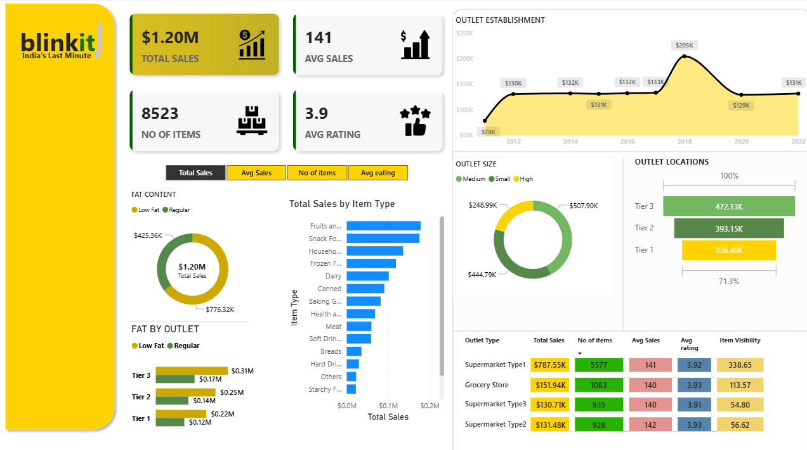

# Business Sales Dashboard (Power BI)

An interactive Power BI dashboard to analyze sales performance by region, product, and time.

##**PREVIEW**

![Key Metrics] (metrics.png)

## What’s inside
- `SalesDashboard.pbix` – Full report (use `.pbit` if you need a clean template)
- `screenshots/` – Key pages of the report
- `data/` – (Optional) small sample dataset for demo

## Features
- Monthly trend, YoY growth
- Top products & regions
- Dynamic filters & drill-through

## How to use
1. Download `SalesDashboard.pbix` (or `SalesDashboard.pbit`).
2. Open in **Power BI Desktop**.
3. If using `.pbit`, provide your data source parameters and refresh.

## Tech Notes
- Built with Power BI Desktop
- DAX measures for KPIs
- (Optional) Data model: Star schema with Date, Product, Customer dims

## Author
- Chetan Zore

#dashboard

